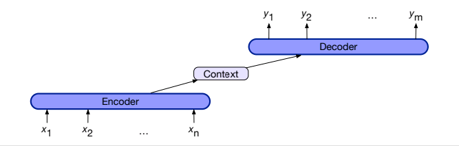
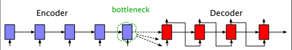
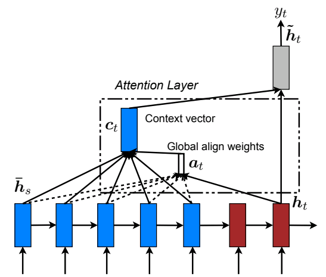

#### Overview
The repo covers implementations of some of the models that are covered in _"Effective Approaches to Attention-based Neural Machine Translation"_ by _Luong et al_, a seminal paper in the field of machine translation.
A neural machine translation (NMT) system directly models the conditional probability $P(y|x)$ of translating a source sentence $x_1, x_2, ..., x_n$ to a target sentence $y_1, y_2, ... y_m$. 
- an encoder that computes a representation for each sentence
- a decoder which generates one target word and decomposes the conditional probability as

$$\text{log} \space p(y|x) = \sum_{j=1}^m \text{log}p(y_j|y_{\lt j, s})$$

#### Problem Setup
Prior to the publication of this paper a majority of architectures used for machine translation consisted of encoder-decoder architectures relying on recurrent neural networks to encode input
sequences in the source language in using hidden states and subsequently using this information encoded in this context to decode an output in the target language using a decoder network.

Encoder-decoder architectures in machine translation are sequence-to-sequence models that take in an input sequence and output a sequence that may be of variable length.
The encoder, as the name suggests, creates a contextualized representation of the input sequence known as the context.
This context is passed to the decoder which generates an output sequence.

  

In an encoder-decoder architecture consisting of only recurrent neural networks, the final hidden state of the encoder serves as the context.
This creates a "bottleneck" since the final hidden state must represent absolutely everything regarding the input sequence as the decoder relies
exclusively on it in order to produce an output sequence. But, information at the beginning of an input sequence may not be 
properly represented by the final hidden state of the encoder.

  

Attention-based models are able to solve this by selectively "attending" to the entire sequence of hidden states representing encoded contexts most relevant to 
producing translated outputs.

 #### Attention-based Models
The paper introduced two novel types of attention-based models: a global approach in which all source words are attended and a local one whereby only a subset of source words are considered
at a time. For both these approaches, the neural networks use stacked LSTMs for encoding the input sequence, 
and at each time step in the decoding phase, they take the hidden states from the top layer of the stacked
LSTMs as inputs to the decoder.

**Global Attention**

The first implementation is global attention, this attends to the entire sequence of hidden states
produced by the stacked LSTMs used for encoding the input.

  

**Local Attention**

- @todo

#### References
- Speech & Language Processing (Text) https://web.stanford.edu/~jurafsky/slp3/
- Effective Approaches to Attention-based Neural Machine Translation (Paper) https://arxiv.org/abs/1508.04025
- Attention Is All You Need (Paper) https://arxiv.org/abs/1706.03762

#### Todo-s
- [x] setup network architecture
- [x] write minibatch code, replace mocks with actual data.
- [x] validate loss computation and optimization
- [x] add teacher forcing
- [x] modularize code
- [x] write training script, integrate `wandb` tracking
- [x] move training to GPUs
- [x] train partially, verify checkpoints
- [x] write inference code
- [ ] update teacher forcing to include a ratio
- [ ] implement loss estimation using validation set
- [ ] implement encoder with global and local attention
- [ ] update readme with architectural & training details
